# ReFrame Test Reporter

A modular Python tool designed to discover, analyze, and report on eligible ReFrame tests by extracting structural metadata directly from `reframe --describe` JSON output. It allows teams to visualize test availability, system coverage, and parameter matrices.

---

## 🚀 Key Features

* **Single-System Reporting**: Generates exhaustive Markdown lists of eligible tests for a targeted system, complete with parameterized test breakdowns, descriptions, and organized test categories.
* **Dynamic Matrix Mode**: Automatically compares multiple test configurations or environment matrices, producing a cross-system compliance map (`✅`/`❌`) accompanied by summary metrics.
* **Parameter Breakdown**: Transparently extracts internal ReFrame parameter injections (e.g., `%param=val`) from test strings and formats them into readable sub-bullets.
* **UEnv Metadata Enrichment**: Built-in support to evaluate tests using local user environment (`UEnv`) recipe directory contexts and image inventories.
* **Deterministic Artifact Retention**: Saves every generated report side-by-side with a timestamped `.reframe.out` log containing raw execution outputs for debugging and auditing.

---
### 🔄 Workflow: Matrix Generation & UEnv Integration

The reporter follows a multi-stage pipeline to transform raw ReFrame metadata and UEnv environment information into a structured compliance matrix.

#### 1. Input Phase (Configuration)
* **CLI Arguments**: The user provides parameters such as `--matrix-mode` (defining targets), `--uenv-recipes-dir`, and `--uenv-image-inventory`.
* **Command Construction**: `CommandBuilder` parses these arguments and prepares the ReFrame command structure.

#### 2. Enrichment Phase (Environment Injection)
* **UEnv Integration**: Before execution, the `Orchestrator` injects critical UEnv paths into the subprocess environment:
    * `RFM_UENV_RECIPES_DIR` $\leftarrow$ `--uenv-recipes-dir`
    * `RFM_UENV_IMAGE_INVENTORY` $\leftarrow$ `--uenv-image-inventory`
* This ensures that ReFrame's `--describe` output is contextually aware of the available software recipes.

#### 3. Execution & Extraction Phase (ReFrame)
* **Subprocess Execution**: The `Executor` runs `reframe --describe` for each target in the matrix.
* **JSON Parsing**: The tool intercepts the standard output, isolates the JSON array within specific delimiters, and parses it into structured Python objects.

#### 4. Aggregation & Rendering Phase (Reporting)
* **Data Normalization**: Extracted metadata is normalized into a consistent schema.
* **Matrix Comparison**: For matrix mode, the `MatrixModeRenderer` compares the presence of tests across different targets.
* **Final Output**: A Markdown report is generated, featuring:
    * ✅/❌ compliance indicators.
    * Parameter breakdowns (e.g., `%compiler=gcc`).
    * Organized test categories.

```mermaid
graph TD
    subgraph "Input Phase"
        A[CLI Arguments<br/>--matrix-mode, --uenv-*] --> B(CommandBuilder)
        C[UEnv Recipes & Inventory] -.->|Injects Env Vars| B
    end

    subgraph "Execution Phase (ReFrame)"
        B --> D{Executor}
        D -->|Runs subprocess| E["reframe --describe<br/>(Target 1, Target 2, ...)"]
        E -->|Raw JSON Output| F[JSON Parser]
    end

    subgraph "Aggregation & Rendering"
        F --> G[Data Normalization]
        G --> H[MatrixModeRenderer]
        H --> I[Final Markdown Report<br/>with ✅/❌ Compliance]
    end
```


---

## 🛠️ Project Architecture

The core logic is structured cleanly within a decoupled, single-responsibility layout:

```text
reframe_reporter/
├── cli.py         # Intercepts flags, sets defaults, and builds the initial schema configuration.
├── models.py      # Structured dataclasses ensuring internal type-safety (ReFrameReporterConfig).
├── builder.py     # Constructs sanitized ReFrame sub-commands and handles complex file naming logic.
├── executor.py    # Subprocess layer featuring bracket-isolation logic to pull clean JSON from noisy logs.
├── renderers.py   # Strategy-pattern generators translating parsed datasets into final Markdown tables.
└── utils.py       # Reusable, robust string sanitizers and Markdown-safe formatting helpers.
```

---

## 💻 Getting Started & Usage

Run the reporter using the main entrance script (`run_report.py`).

### 1. Single-System Mode
Analyze a single target system configuration to list matching test profiles.
```bash
python3 run_report.py \
   --system daint \
   --mode production \
   -C cscs-reframe-tests/config/cscs.py \
   -c cscs-reframe-tests/checks
```

### 2. Matrix Mode (Multi-Target Coverage)
Provide multiple target entries to generate an aggregated test matrix. The `--matrix-mode` flag accepts a comma-separated list of targets formatted as `label:system:mode`.

**Example with multiple targets:**
```bash
python3 run_report.py \
   --matrix-mode "daint-maint:daint:maintenance,daint-prod:daint:production" \
   --tag maintenance \
   -C cscs-reframe-tests/config/cscs.py \
   -c cscs-reframe-tests/checks
```

### 3. Metadata Ingestion with User Environments (UEnv)
Run checks using dynamic software recipes without strictly demanding fully initialized software trees locally:
```bash
python3 run_report.py \
  --uenv-recipes-dir alps-uenv/recipes \
  --uenv-image-inventory alps-uenv/inventory.json \
  --system daint \
  -C cscs-reframe-tests/config/cscs.py
```

---

## 📋 Command-Line Interface Reference

| Argument / Flag | Input Type | Description |
| :--- | :--- | :--- |
| `--system` | `str` | Name of the ReFrame infrastructure partition (e.g., `daint`, `alps`). |
| `--mode` | `str` | ReFrame configuration profile mode context (Defaults to `single`). |
| `-C`, `--checks` | `path` | **Required**. File path or directory containing the target ReFrame configuration files. Can be passed multiple times. |
| `-c`, `--config_dir` | `path` | Directory containing test configurations to forward directly into ReFrame. |
| `-R`, `--recursive`| *Flag* | Instructs the framework to search for check directories recursively. |
| `-f`, `--filename` | `str` | Custom base string for the output report (Defaults to `eligible_tests.md`). |
| `-o`, `--output_dir` | `path` | Override path for outputs (Defaults to the checking script's root directory). |
| `--uenv-recipes-dir`| `path` | Path leading to custom UEnv deployment recipes. |
| `--uenv-image-inventory`| `path`| Path to the dynamic UHM image inventory JSON file. |
| `--matrix-mode` | `str` | Comma-separated list map for system testing targets (`label:system:mode`). |
| `--matrix-tag` | `str` | Matrix entry argument filter (`label:arg`). Can be passed multiple times. |
| `-v`, `--verbose` | *Flag* | Enables verbose logging output. |

> 💡 **Note:** Any arguments provided at the very end of your script invocation following a double-dash (`--`) are cleanly processed, normalized, and seamlessly forwarded right to the underlying ReFrame subprocess.

---

## 📊 Sample Output Format

When executing reports, filenames are automatically managed depending on filters to guarantee unique outputs (e.g., `eligible_tests_daint_mode-production_tags-maintenance.md` or `eligible_tests_matrix.md`).

### Single-System View
| Test name | Description | Category |
| :--- | :--- | :--- |
| `Legacy_App_Check`<br>• %compiler=gcc<br>• %nodes=2 | Validates MPI connectivity on production nodes. | `apps/physics` |

### Matrix Compliance View
### apps/physics
| Test name | daint_gpu-maint | daint_cpu-maint | alps_nvgpu-maint |
| :--- | :---: | :---: | :---: |
| `Legacy_App_Check`<br>• %compiler=gcc | ✅ | ❌ | ✅ |

---

## How to generate the coverage reports 

### Pre-req: Generate UENV inventories for the target systems

```bash
python3 ./cscs-reframe-tests/reframe_reporter/generate_uenv_image_inventory.py \
--output-dir  ./cscs-reframe-tests/reframe_reporter/snapshots/uenv-inventories/ \
--system daint,eiger,santis,clariden,starlex
```
### List for Daint only

```bash
python3 cscs-reframe-tests/reframe_reporter/run_report.py \
--system daint --mode production \
-C cscs-reframe-tests/config/cscs.py -c cscs-reframe-tests/checks \
-R --uenv-recipes-dir alps-uenv/recipes \
--uenv-image-inventory cscs-reframe-tests/reframe_reporter/snapshots/uenv-inventories/uenv_image_inventory_daint.json \
-o cscs-reframe-tests/reframe_reporter/snapshots
```

### Coverage Matrix for Daint, Eiger, Santis, Claride & Starlex

#### Maintenance 

```bash
python3 cscs-reframe-tests/reframe_reporter/run_report.py \
--matrix-mode daint-maint:daint:maintenance,eiger-maint:eiger:maintenance,santis-maint:santis:maintenance,clariden-maint:clariden:maintenance,starlex-maint:starlex:maintenance \
-C cscs-reframe-tests/config/cscs.py -c cscs-reframe-tests/checks \
-R --uenv-recipes-dir alps-uenv/recipes \
--uenv-image-inventory cscs-reframe-tests/reframe_reporter/snapshots/uenv-inventories/uenv_image_inventory_daint_eiger_santis_clariden_starlex.json \
-o cscs-reframe-tests/reframe_reporter/snapshots \
-f eligible_tests_matrix_mode-maintenance.md
```

#### Production 
```bash
python3 cscs-reframe-tests/reframe_reporter/run_report.py \
--matrix-mode daint-prod:daint:production,eiger-prod:eiger:production,santis-prod:santis:production,clariden-prod:clariden:production,starlex-prod:starlex:production \
-C cscs-reframe-tests/config/cscs.py -c cscs-reframe-tests/checks \
-R --uenv-recipes-dir alps-uenv/recipes \
--uenv-image-inventory cscs-reframe-tests/reframe_reporter/snapshots/uenv-inventories/uenv_image_inventory_daint_eiger_santis_clariden_starlex.json \
-o cscs-reframe-tests/reframe_reporter/snapshots \
-f eligible_tests_matrix_mode-production.md
```

#### Maintenance & Production

```bash
python3 cscs-reframe-tests/reframe_reporter/run_report.py \
--matrix-mode daint-maint:daint:maintenance,daint-prod:daint:production,eiger-maint:eiger:maintenance,eiger-prod:eiger:production,santis-maint:santis:maintenance,santis-prod:santis:production,clariden-maint:clariden:maintenance,clariden-prod:clariden:production,starlex-maint:starlex:maintenance,starlex-prod:starlex:production \
-C cscs-reframe-tests/config/cscs.py -c cscs-reframe-tests/checks \
-R --uenv-recipes-dir alps-uenv/recipes \
--uenv-image-inventory cscs-reframe-tests/reframe_reporter/snapshots/uenv-inventories/uenv_image_inventory_daint_eiger_santis_clariden_starlex.json \
-o cscs-reframe-tests/reframe_reporter/snapshots \
-f eligible_tests_matrix_mode-maintenance-production.md
```
