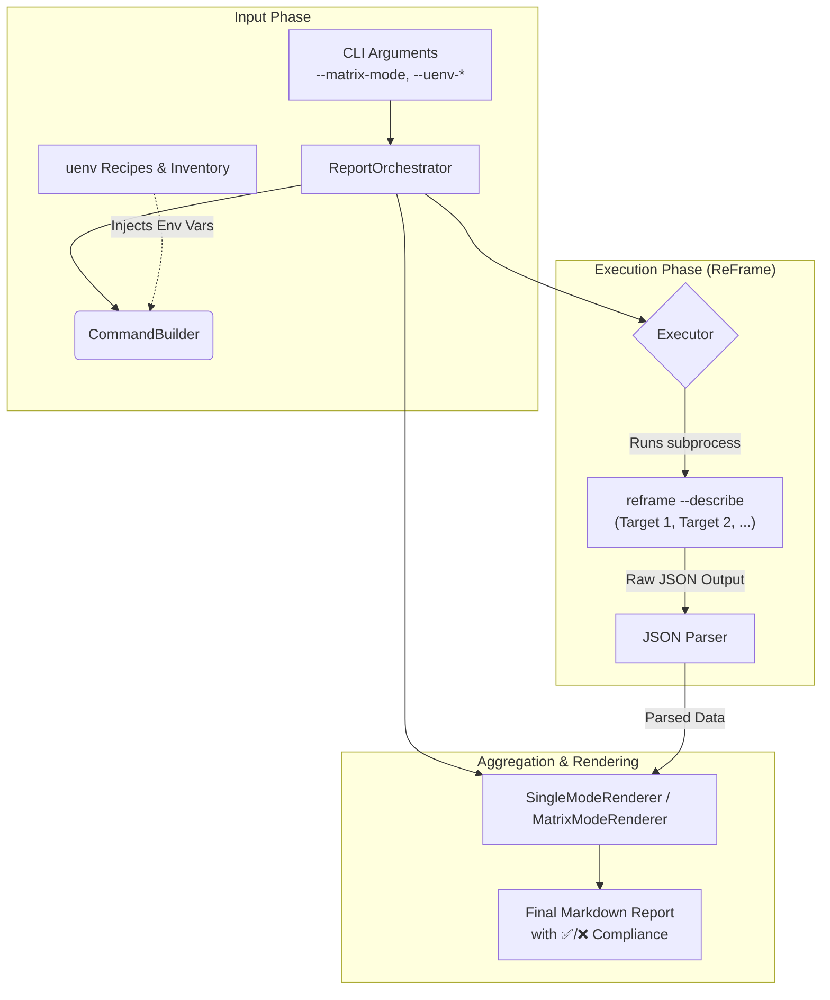

# ReFrame Test Reporter

A modular Python tool for discovering, analyzing, and reporting eligible ReFrame tests by extracting structural metadata from `reframe --describe` JSON output.

---

## 🚀 Key Features

* **Matrix Reporting**: Generates comprehensive Markdown reports for one or more target configurations, producing a cross-system test eligibility matrix (✅/❌) with summary metrics.
* **Parameter Breakdown**: Extracts internal ReFrame parameter injections (e.g., %param=val) and formats them into readable sub-bullets.
* **uenv Metadata Enrichment**: Extends ReFrame test listing by cross-checking:
  * `uenv image ls --json`
  * `reframe.yaml` from [https://github.com/eth-cscs/alps-uenv](https://github.com/eth-cscs/alps-uenv)


---

## Prerequisites

Before using the ReFrame Test Reporter, ensure the following are available:

- **Python 3.9+** — required for type hint syntax used throughout the codebase.
- **ReFrame** — must be installed and accessible in `PATH`. The reporter runs `reframe --describe` as a subprocess.
- **uenv CLI** — required for `generate_uenv_image_inventory.py` to query available UENV images on Alps vClusters.
- **Access to CSCS vClusters** — needed for uenv inventory generation and for running ReFrame with system configurations.

---

### 🔄 Workflow: Matrix Generation & uenv Integration

The reporter follows a multi-stage pipeline to transform raw ReFrame metadata and uenv environment information into a structured compliance matrix.

#### 1. Input Phase (Configuration)
* **CLI Arguments**: The user provides parameters such as `--matrix-mode` (defining targets), `--uenv-recipes-dir`, and `--uenv-image-inventory`.
* **Command Construction**: `CommandBuilder` parses these arguments and prepares the ReFrame command structure.

#### 2. Enrichment Phase (Environment Injection)
* **uenv Integration**: Before execution, the `Orchestrator` injects uenv paths into the subprocess environment:
    * `RFM_UENV_RECIPES_DIR` $\leftarrow$ `--uenv-recipes-dir` (ingests `reframe.yaml` data from the uenv recipes directory)
    * `RFM_UENV_IMAGE_INVENTORY` $\leftarrow$ `--uenv-image-inventory` (ingests output from `uenv image ls --json`)
* This ensures that ReFrame's `--describe` output is contextually aware of the available software recipes.

#### 3. Execution & Extraction Phase (ReFrame)
* **Subprocess Execution**: The `Executor` runs `reframe --describe` for each target in the matrix.
* **JSON Parsing**: The tool intercepts the standard output, isolates the JSON array within specific delimiters, and parses it into structured Python objects.

#### 4. Aggregation & Rendering Phase (Reporting)
* **Data Normalization**: Extracted metadata is normalized into a consistent schema.
* **Matrix Comparison**: For matrix mode, the `MatrixModeRenderer` compares the presence of tests across different targets.
* **Final Output**: A Markdown report is generated, featuring:
    * ✅/❌ eligibility checkboxes.
    * Parameter breakdowns (e.g., `%compiler=gcc`).
    * Organized test categories.


---

## 🛠️ Project Architecture

The core logic is structured cleanly within a decoupled, single-responsibility layout:

```text
reframe_reporter/
├── run_report.py                       # Main entry point.
├── cli.py                              # Parses CLI flags, applies defaults, and builds the configuration schema.
├── models.py                           # Structured dataclasses ensuring internal type-safety (ReFrameReporterConfig).
├── orchestrator.py                     # Coordinates execution flow between builder, executor, and renderers.
├── builder.py                          # Constructs sanitized ReFrame sub-commands and handles complex file naming logic.
├── executor.py                         # Subprocess layer featuring bracket-isolation logic to pull clean JSON from noisy logs.
├── renderers.py                        # Strategy-pattern generators translating parsed datasets into final Markdown tables.
├── utils.py                            # Reusable, robust string sanitizers and Markdown-safe formatting helpers.
├── generate_uenv_image_inventory.py    # Standalone script to query uenv CLI and produce per-system or merged JSON inventories.
├── CHANGELOG.md                        # Version history.
└── README.md                           # This file.
```

> See [CHANGELOG.md](CHANGELOG.md) for the full version history.

---

## 💻 Getting Started & Usage

Run the reporter using the main entry script (`run_report.py`).

### 1. Single-System Mode
Analyze a single target system configuration to list matching test profiles.
```bash
python3 run_report.py \
   --system daint \
   --mode production \
   -C cscs-reframe-tests/config/cscs.py \
   -c cscs-reframe-tests/checks
```

### 2. Matrix Mode 
Provide multiple target entries to generate an aggregated test matrix. The `--matrix-mode` flag accepts a comma-separated list of targets formatted as `label:system:mode`.

**Example with multiple targets:**
```bash
python3 run_report.py \
   --matrix-mode "daint-maint:daint:maintenance,daint-prod:daint:production" \
   -C cscs-reframe-tests/config/cscs.py \
   -c cscs-reframe-tests/checks
```

### 3. Matrix Tag 
Compare test coverage across different tag expressions on one or more systems. The `--matrix-tag` flag accepts a comma-separated list of targets formatted as `label:system:tag`.

```bash
python3 run_report.py \
   --matrix-tag "daint-prod:daint:production,daint-maint:daint:maintenance" \
   -C cscs-reframe-tests/config/cscs.py \
   -c cscs-reframe-tests/checks
```

### 4. Metadata Ingestion with User Environments (uenv)
Perform uenv-aware test listing using a previously generated uenv image inventory.

```bash
python3 run_report.py \
  --matrix-mode "daint-maint:daint:maintenance,daint-prod:daint:production" \
  --uenv-recipes-dir alps-uenv/recipes \
  --uenv-image-inventory alps-uenv/inventory.json \
  -C cscs-reframe-tests/config/cscs.py
```
* **Requirements** 
  * Creation of a uenv inventory (list of available uenvs on each vCluster)
    * See instructions below for generating uenv inventories
  * uenv recipes (from [alps-uenv](https://github.com/eth-cscs/alps-uenv))
---

## 📋 Command-Line Interface Reference

| Argument / Flag | Input Type | Description |
| :--- | :--- | :--- |
| `-C`, `--checks`     | `path` | **Required.** Path(s) forwarded as ReFrame's `-C` (config file). Can be specified multiple times. |
| `-c`, `--config_dir` | `path` | **Required.** Directory forwarded as ReFrame's `-c` (check path). |
| `-R`, `--recursive`| *Flag* | Instructs the framework to search for check directories recursively. |
| `-f`, `--filename` | `str` | Custom base string for the output report (Defaults to `eligible_tests.md`). |
| `-o`, `--output_dir` | `path` | Override path for outputs (Defaults to the current working directory). |
| `--uenv-recipes-dir`| `path` | Repository containing the `reframe.yaml` files. |
| `--uenv-image-inventory`| `path`| Path to the JSON file containing the inventory of uenvs. |
| `--matrix-mode` | `str` | Comma-separated list map for system testing targets (`label:system:mode`). |
| `--matrix-tag` | `str` | Comma-separated list for tag-based coverage matrix (`label:system:tag`). Mutually exclusive with `--matrix-mode`. |
| `-v`, `--verbose` | *Flag* | Enables verbose logging output. |

> 💡 **Note:** Any arguments provided at the very end of your script invocation following a double-dash (`--`) are cleanly processed, normalized, and seamlessly forwarded right to the underlying ReFrame subprocess.

---

## UENV Integration Details

The reporter enriches ReFrame test listings by integrating with the UENV (User Environment) system through three environment variables consumed by `config/utilities/uenv.py`:

| Environment Variable | Source | Purpose |
| :--- | :--- | :--- |
| `RFM_UENV_RECIPES_DIR` | `--uenv-recipes-dir` | Path to `alps-uenv/recipes` containing `extra/reframe.yaml` metadata files. |
| `RFM_UENV_IMAGE_INVENTORY` | `--uenv-image-inventory` | Path to a pre-generated JSON inventory (from `generate_uenv_image_inventory.py`). |
| `RFM_UENV_TARGET_SYSTEMS` | Inferred from `--matrix-mode` | Comma-separated systems for per-system `uenv image find --json @<system>` queries. |

### How it works

1. **`_load_uenv_image_inventory(path)`** — Loads the UENV image inventory from either:
   - A pre-generated JSON file (set via `RFM_UENV_IMAGE_INVENTORY`).
   - Direct CLI queries (`uenv image find --json @<system>`) per target system when `RFM_UENV_TARGET_SYSTEMS` is set. Results are merged with deduplication.
   - Falls back to `uenv image find --json` with no system filter (or `@$CLUSTER_NAME`).

2. **`_recipe_target_systems(recipe_root, recipe_dir_path, inventory_records)`** — Matches a recipe (by name/version/uarch) against inventory records to determine which systems it is available on.

3. **`_load_uenvs_from_recipes(recipe_dir)`** — Scans the recipes directory for `extra/reframe.yaml` files, resolves target systems via inventory records, and builds structured environment definitions for ReFrame.

When `RFM_UENV_RECIPES_DIR` is set, the existing `CSCS_RFM_UENV` / `RFM_UENV` variable path is bypassed entirely and the recipe-based discovery is used instead.

---

## Coverage Matrix Snapshots

* [https://github.com/eth-cscs/cscs-reframe-tests/reframe_reporter/snapshots](./snapshots)

---

## How to Generate Coverage Reports 

### Prerequisite: Generate UENV inventories for the target systems

```bash
python3 ./cscs-reframe-tests/reframe_reporter/generate_uenv_image_inventory.py \
--output-dir  ./cscs-reframe-tests/reframe_reporter/snapshots/uenv-inventories/ \
--system daint,eiger,santis,clariden,starlex
```
### Single-System Report (Daint)

```bash
python3 cscs-reframe-tests/reframe_reporter/run_report.py \
--system daint --mode production \
-C cscs-reframe-tests/config/cscs.py -c cscs-reframe-tests/checks \
-R --uenv-recipes-dir alps-uenv/recipes \
--uenv-image-inventory cscs-reframe-tests/reframe_reporter/snapshots/uenv-inventories/uenv_image_inventory_daint.json \
-o cscs-reframe-tests/reframe_reporter/snapshots
```

### Coverage Matrix for Daint, Eiger, Santis, Clariden & Starlex

#### Maintenance 

```bash
python3 cscs-reframe-tests/reframe_reporter/run_report.py \
--matrix-mode daint-maint:daint:maintenance,eiger-maint:eiger:maintenance,santis-maint:santis:maintenance,clariden-maint:clariden:maintenance,starlex-maint:starlex:maintenance \
-C cscs-reframe-tests/config/cscs.py -c cscs-reframe-tests/checks \
-R --uenv-recipes-dir alps-uenv/recipes \
--uenv-image-inventory cscs-reframe-tests/reframe_reporter/snapshots/uenv-inventories/uenv_image_inventory_daint_eiger_santis_clariden_starlex.json \
-o cscs-reframe-tests/reframe_reporter/snapshots \
-f eligible_tests_matrix_mode-maintenance.md
```

#### Production 
```bash
python3 cscs-reframe-tests/reframe_reporter/run_report.py \
--matrix-mode daint-prod:daint:production,eiger-prod:eiger:production,santis-prod:santis:production,clariden-prod:clariden:production,starlex-prod:starlex:production \
-C cscs-reframe-tests/config/cscs.py -c cscs-reframe-tests/checks \
-R --uenv-recipes-dir alps-uenv/recipes \
--uenv-image-inventory cscs-reframe-tests/reframe_reporter/snapshots/uenv-inventories/uenv_image_inventory_daint_eiger_santis_clariden_starlex.json \
-o cscs-reframe-tests/reframe_reporter/snapshots \
-f eligible_tests_matrix_mode-production.md
```

#### Maintenance & Production

```bash
python3 cscs-reframe-tests/reframe_reporter/run_report.py \
--matrix-mode daint-maint:daint:maintenance,daint-prod:daint:production,eiger-maint:eiger:maintenance,eiger-prod:eiger:production,santis-maint:santis:maintenance,santis-prod:santis:production,clariden-maint:clariden:maintenance,clariden-prod:clariden:production,starlex-maint:starlex:maintenance,starlex-prod:starlex:production \
-C cscs-reframe-tests/config/cscs.py -c cscs-reframe-tests/checks \
-R --uenv-recipes-dir alps-uenv/recipes \
--uenv-image-inventory cscs-reframe-tests/reframe_reporter/snapshots/uenv-inventories/uenv_image_inventory_daint_eiger_santis_clariden_starlex.json \
-o cscs-reframe-tests/reframe_reporter/snapshots \
-f eligible_tests_matrix_mode-maintenance-production.md
```

## Tag-based Matrix

```bash
python3 cscs-reframe-tests/reframe_reporter/run_report.py \
  --matrix-tag "prod:daint:production,maint:daint:maintenance,node-validator:daint:vs-node-validator" \
  -C cscs-reframe-tests/config/cscs.py \
  -c cscs-reframe-tests/checks \
  -o reframe_reporter/snapshots
```
